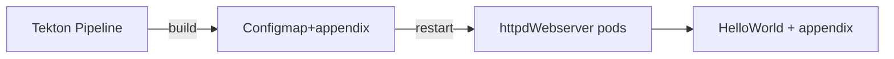

# Tkn-test-simple-httpd

This Helm chart generates a webserver which shows a simple "Hello World!" text and deploy a tekton pipelines to demonstrate how webservers can modified with an appendix var. the Tekton Pipeline build a simple var that can be defined as parameter and load it to the running page.

## Helm Chart

How to install?

```bash
# login with oc cli to project you want to install
$ oc project <NamespaceName>
# install -> check values.yaml and edit or inject vars via helm cli e.g --set deployment.enabled=false
$ helm install <myDeployName> .

```

## Prerequisites

* CodeReadyContainers with Tekton installed (Openshift/Kubernetes Cluster)
* Helm CLI
* oc/kubectl -CLI

## Whats the showcase goal?

This Helm chart deploys a httpd apach webserver which shows a simple hello world!. The HTML code is located as a configmap. at the moment you trigger the helloworld Pipeline, you have to define a param called "appendix". this string is added to the config map by the tekton pipeline. tekton then restarts the pod via oc rollout command so that the new configmap is loaded. now you should see the new page with the given param!



## DOING

1. Create CodeReadyContainers local cluster -> https://console.redhat.com/openshift/create/local , you have to create a free redhat account
2. Make sure you have enough memory configured to crc cause the tekton operator comes with a whole horder pods that need ram and diskspace

   ```bash
   $ crc config set memory 28610
   $ crc set disk-size 100
   $ crc config view
   - consent-telemetry                     : no
   - cpus                                  : 8
   - disk-size                             : 100
   - memory                                : 28610
   - pull-secret-file                      : ./pull-secret.txt
   ```
3. Install helm chart to a namespace
4. See notes in your Terminal after installing, it render your sed command, for add the app url for your /etc/hosts dns entry of the apllication

   ```bash
   Add apache-tekton-test.apps-crc.testing to your local /etc/hosts to reach the app.
   $ sudo sed -i '/^# Added by CRC/{n;/^192.168.130.11 /s/192.168.130.11 /192.168.130.11 apache-tekton-test.apps-crc.testing /}' /etc/hosts
   ```
5. After you set /etc/hosts entry you are able to connect to the application -> https://apache-tekton-test.apps-crc.testing/index.html -> you see "Hello World!"
6. Let's add our name to the Hello World! go to left side menu "Pipelines->Pipelines" there you see "helloworld" Pipeline.By the Pipeline click on "3 dots button - right side" and then select "start"
7. A formular comes up, there your have to fill your name or use the prefilled variable, then press "start bluebutton - lower right"
8. Now the pipeline is running! when its done, reload the url in browser
9. See: Hello World and <yourName>! This is generated by a Tekton Pipeline!
10. done! repeat as often you want!